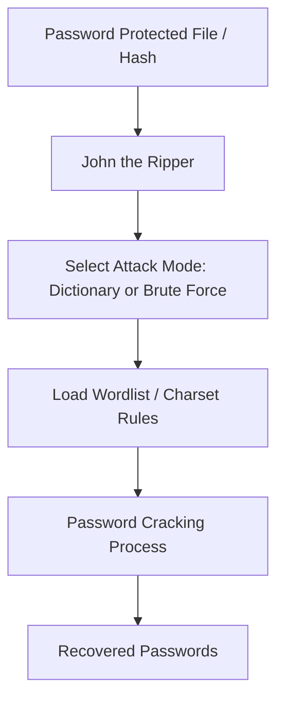

# Using-tools-like-John-the-Ripper-for-password-cracking
## AIM:
To crack password hashes using John the Ripper in Kali Linux.
## REQUIREMENTS:
- **Operating System:** Kali Linux / Ubuntu / Windows (with JtR binaries)
- **Tools:**
    - John the Ripper (Community/Pro version)
    - Hash generating tools (e.g., openssl, unshadow)
- **Test Data:**
    - /etc/shadow file (Linux hashed passwords)
    - Custom password-protected file (ZIP, RAR, etc.)
## ARCHITECTURE DIAGRAM:

## DESIGN STEPS:
### Step 1: Install John the Ripper
```bash
sudo apt update
sudo apt install john -y
```

### Step 2: Prepare Hash File
- Extract hashes (Linux example):
```
unshadow /etc/passwd /etc/shadow > myhashes.txt
```
- For a ZIP file:
```
zip2john secret.zip > ziphash.txt
```
### Step 3: Run John the Ripper
- Dictionary Attack:
```
john --wordlist=/usr/share/wordlists/rockyou.txt myhashes.txt
```
- Brute Force (Incremental Mode):
```
john --incremental myhashes.txt
```
### Step 4: Show Cracked Passwords
```
john --show myhashes.txt
```
## PROGRAM:
1. **Hash Extraction** – Obtain password hashes from system files or encrypted archives.
2. **Attack Mode Selection** – Choose between dictionary, brute force, or hybrid.
3. **Cracking Phase** – John the Ripper runs through candidate passwords.
4. **Password Recovery** – Successfully cracked passwords are displayed.

## Save A file named hello.txt :
## Encrypt with password the file 


## Run john helper:


## In john terminal change the directory 

## Use Zip2john command  
```bash
zip2jhon bello.txt.zip > hash.txt
```


## OUTPUT:
Cracked Passwords from Hash File

## RESULT:
The password hashes were successfully cracked using John the Ripper.

